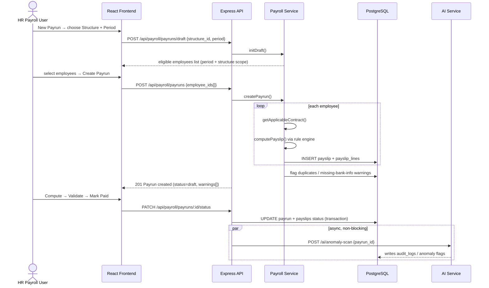

# PeoplePay360 — Architecture

> A pragmatic layered architecture for a payroll/ERP domain — not over-engineered microservices, not a tangled single-file script. Optimized for 4 devs shipping in 24h without merge conflicts, and for judges asking "how does this scale?"

---

## 1. Why Layered-Service, not Full Microservices or Pure Hexagonal

Payroll/HR is a **relational, transaction-heavy CRUD-plus-rules-engine domain**, not a graph/AI-extraction domain. The right shape is:

- **One monolith API** (fast to build, zero network overhead in a demo)
- **Strict internal layering** so modules stay independent (Employee code never reaches into Payroll's DB queries directly)
- **One separated AI microservice** — the only thing that legitimately deserves isolation, because it calls an external LLM API that can rate-limit or fail, and must never be able to take payroll transactions down with it

```
┌─────────────────────────────────────────────────────────────────┐
│                     React Frontend (Vite + Tailwind)             │
│   Nav: Employees | Contracts | Attendance | Time Off | Payroll   │
│                    | Reports/Dashboard                            │
└───────────────────────────────┬───────────────────────────────────┘
                                │ REST (JWT auth header)
                                ▼
┌─────────────────────────────────────────────────────────────────┐
│                    Express API Gateway (backend/)                 │
│  Routes → Controllers → Services → Repositories → PostgreSQL     │
│  RBAC middleware on every route · input validation (zod/joi)      │
└──────┬───────────┬────────────┬────────────┬──────────┬──────────┘
       │           │            │            │          │
       ▼           ▼            ▼            ▼          ▼
  hr-core     time-ops      payroll      dashboard   ai-bridge
 (Employee,  (Attendance,  (Structure,   (aggregate   (calls the
 Contract,   TimeOff,      Rule, Payrun,  queries)     AI service
 Schedule)   Allocation)   Payslip, PDF)               over HTTP)
       │           │            │            │          │
       └───────────┴──────┬─────┴────────────┴──────────┘
                          ▼
                 PostgreSQL (single DB, strict FKs)
                          ▲
                          │ HTTP (JSON in/out only)
              ┌───────────┴────────────┐
              │  ai-service (FastAPI)   │
              │  - NL query → SQL intent│
              │  - anomaly detection     │
              │  - payroll trend predict │
              └─────────────────────────┘
```

## 2. Module Boundaries (maps directly to Team Matrix in README)

| Module (backend/src/modules/) | Owns tables | Owner |
|---|---|---|
| `hr-core` | `users`, `roles`, `employees`, `departments`, `contracts`, `working_schedules`, `schedule_lines` | Dev 1 |
| `time-ops` | `attendances`, `time_off_types`, `allocations`, `time_off_requests` | Dev 2 |
| `payroll` | `salary_structures`, `salary_rules`, `payruns`, `payslips`, `payslip_lines` | Dev 3 |
| `dashboard` | (read-only aggregate queries across all above, no owned tables) | Dev 4 |
| `ai-service` (separate process) | `audit_logs` (write), reads everything else read-only via internal API | Dev 4 |

**Rule:** a module may only write to its own tables. If Payroll needs employee data, it calls `hr-core`'s service function (in-process import) or its repository — never raw SQL against another module's table. This is the one discipline that prevents 4 people from creating 4 different versions of "how do I get an employee's active contract."

## 3. Layer Responsibilities (inside every module)

```
modules/<module>/
├── <module>.routes.js       # URL → controller mapping, RBAC middleware attached here
├── <module>.controller.js   # parses req, calls service, shapes response — NO business logic
├── <module>.service.js      # ALL business logic lives here (contract period resolution,
│                             #   leave balance math, salary rule sequencing)
├── <module>.repository.js   # only file allowed to write SQL/query-builder calls
└── <module>.validation.js   # zod/joi schemas for every input DTO
```

Dependency direction is one-way: `routes → controller → service → repository → DB`. Controllers never touch the DB directly; services never touch `req`/`res`.

## 4. The Two Pieces of Real Business Logic (this is what separates us from a toy CRUD app)

### 4.1 Period-Aware Contract Resolution
```
function getApplicableContract(employeeId, periodStart, periodEnd):
    contract = SELECT * FROM contracts
               WHERE employee_id = employeeId
               AND status = 'active'
               AND start_date <= periodEnd
               AND (end_date IS NULL OR end_date >= periodStart)
               ORDER BY start_date DESC LIMIT 1
    if not contract: raise PayrollError("No applicable contract for period")
    return contract
```
Enforced at the DB level too: a partial unique/exclusion constraint (or app-level transaction check) prevents two *active* contracts overlapping for the same employee.

### 4.2 Config-Driven Salary Rule Engine (the core of the payroll module)
```
function computePayslip(employee, contract, structure, period):
    context = { contract_wage: contract.wage, worked_days: ..., basic: 0, gross: 0 }
    rules = SELECT * FROM salary_rules WHERE structure_id = structure.id ORDER BY sequence
    lines = []
    for rule in rules:
        value = switch rule.calc_method:
            case 'fixed':      rule.amount
            case 'percentage': context[rule.base_code] * (rule.amount / 100)
            case 'formula':    safeEval(rule.formula_text, context)   # sandboxed, whitelisted vars only
        context[rule.code] = value
        lines.push({ rule_id: rule.id, label: rule.name, category: rule.category, value })
    gross = sum(l.value for l in lines if l.category in ['basic','allowance'])
    net   = gross - sum(l.value for l in lines if l.category == 'deduction')
    return { lines, gross, net }
```
New allowance/deduction rules require **zero code changes** — add a row in `salary_rules`. This is the line to say out loud to judges.

## 5. End-to-End Sequence: Creating a Payrun



## 6. Security & Validation (non-negotiable, judges check this)

1. **RBAC middleware** on every route, checked server-side against the 5 roles in the spec (Admin, HR Manager, HR Payroll User, HR Payroll Manager, Employee). Never trust a hidden frontend button.
2. **Users cannot self-elevate roles** — role field is only writable via the Admin user-management endpoint, never via a user's own profile-update endpoint.
3. **Input validation** on every write endpoint (zod/joi schema) — reject before it reaches the service layer.
4. **Sandboxed formula evaluation** for `formula`-type salary rules — whitelist allowed variables/operators only, no `eval()` of arbitrary JS, no filesystem/network access from inside a rule.
5. **JWT expiry + refresh**, passwords hashed with bcrypt, no plaintext anywhere including logs.

## 7. Scalability Answer (for the "how does this scale" question)

> "Modules are already logically isolated with their own tables and service boundaries. To go from this monolith to microservices, each `modules/<name>` folder becomes its own service — the repository layer swaps from direct SQL to an HTTP/gRPC client against the same interface, and the AI service already proves this pattern works because it's deployed as a separate process today. On the DB side, `payslip_lines` and `attendances` are the two high-growth tables — both are already period/employee-indexed and ready to partition by `period` if volume grows."
